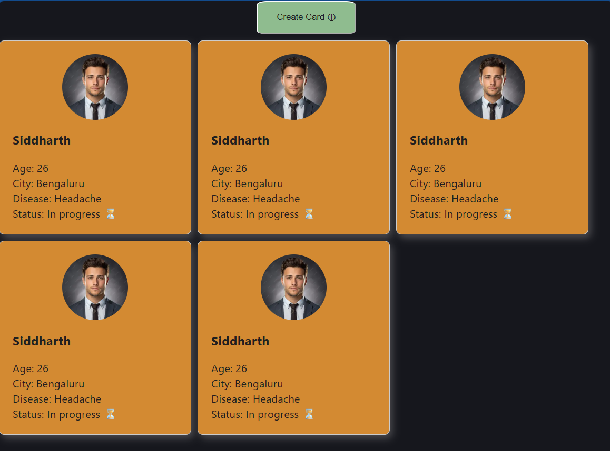

# React + Vite

This template provides a minimal setup to get React working in Vite with HMR and some ESLint rules.

Currently, two official plugins are available:

- [@vitejs/plugin-react](https://github.com/vitejs/vite-plugin-react/blob/main/packages/plugin-react) uses [Oxc](https://oxc.rs)
- [@vitejs/plugin-react-swc](https://github.com/vitejs/vite-plugin-react/blob/main/packages/plugin-react-swc) uses [SWC](https://swc.rs/)

## React Compiler

The React Compiler is not enabled on this template because of its impact on dev & build performances. To add it, see [this documentation](https://react.dev/learn/react-compiler/installation).

## Expanding the ESLint configuration

If you are developing a production application, we recommend using TypeScript with type-aware lint rules enabled. Check out the [TS template](https://github.com/vitejs/vite/tree/main/packages/create-vite/template-react-ts) for information on how to integrate TypeScript and [`typescript-eslint`](https://typescript-eslint.io) in your project.

**---------------------------------------------------------------------------------------------------------------------------------------------------------------------------------------------------------------------------------------------**

**Date: 18-06-2026**

**Stage 1: Beginning of the project**

*Plan:* When you click on the button, it should show a card containing the patient's information

*Process:*
 - Firstly, I have built a 'create card ⊕' button.
 - I have created a card with the profile image feature. 
 - The data is saved manually, i.e. you can't make changes through UI.
 
 *Challenge faced:*
 Since I am using React + Vite, I faced a small bug/setting named Chokidar(File Watching) issue.
 In some operating systems( Windows/WSL/ Docker), Vite does not know that the file has been saved.

 *Solved:*
 I added the following piece of code to the vite.config.js
 

    import { defineConfig } from 'vite'
    import react from '@vitejs/react-plugin'

    export default defineConfig({
      plugins: [react()],
      // 👇 
      server: {
        watch: {
          usePolling: true,
        },
      },
    })
then restarted the server in the terminal. It worked.

*Output:*

img. Output1